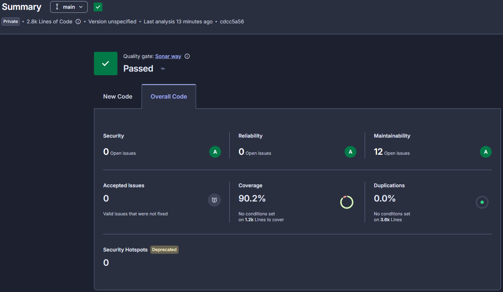

# auto-repair-shop-execution

Microsserviço **execution** do Auto Repair Shop: dono do catálogo de serviços e do estoque de
insumos, conduz o diagnóstico da OS resolvendo preços e reservando insumos de forma atômica,
gerencia a fila de execução e executa as compensações da saga. Kotlin/Ktor sobre **DynamoDB
single-table**.

## Arquitetura

Esqueleto hexagonal multi-módulo, com storage em DynamoDB single-table e a metade **consumidora**
dos eventos da saga.

### Coreografia (sem orquestrador)

Cada serviço reage a eventos e deriva o próprio estado. Não há coordenador central.

```
                 OrderCreated (order)
                        |
                        v
          +--------------------------------+
          |  Execution AWAITING_DIAGNOSIS   |  (sem evento: a OS entra na fila)
          +--------------------------------+
                        |
   REST mecanico: POST /v1/orders/{id}/finish-diagnosis
                  {services: [uuid], supplies: [{id, quantity}]}
                        |
          +------------------------------+
          |  reserva atomica de insumos   |
          +------------------------------+
             |                      |
   estoque ok|                      |estoque insuficiente / corrida
             v                      v
      DiagnoseFinished        SuppliesUnavailable
        (-> order)          (-> order, Execution CANCELED)
             |
   PaymentConfirmed (billing) --> Execution ENQUEUED (sem evento)
             |
   REST mecanico: start  -> ExecutionStarted  (-> order)
                  finish -> ExecutionFinished (-> order)
                  fail   -> ExecutionFailed   (-> order, billing refund)

   Compensacoes que liberam a reserva (devolvem estoque, cancelam a Execution):
     QuoteRejected (billing) . PaymentFailed (billing) . ReservationExpired (job)
```

Cada evento é um fato imutável, e o estado da OS no execution é derivado da sequência de eventos
recebidos somada às próprias transições. Isso remove acoplamento temporal e ponto único de
coordenação, ao custo de idempotência e compensações explícitas.

### Contrato de eventos

Consome (fila `auto-repair-shop-execution-queue-{env}`): `OrderCreated`, `PaymentConfirmed`,
`QuoteRejected`, `PaymentFailed`.
Produz (tópico `auto-repair-shop-execution-events-{env}`, attribute `eventType` camelCase):
`DiagnoseFinished`, `SuppliesUnavailable`, `ExecutionStarted`, `ExecutionFinished`,
`ExecutionFailed`, `ReservationExpired`. Envelope:
`{ eventId, eventType, eventVersion, occurredAt, payload }`.

`DiagnoseFinished` (consumido pelo order) resolve `name` e `price` de cada serviço no catálogo
local, `name` e `unitPrice` de cada insumo no estoque local, carrega o `diagnosedBy` extraído do
JWT e calcula `totalAmount`:

```json
{
  "orderId": "uuid", "reservationId": "uuid",
  "diagnosedBy": { "id": "uuid", "document": "12345678909" },
  "customer": { "name": "...", "email": "..." },
  "services": [ { "id": "uuid", "name": "...", "price": 100.00 } ],
  "supplies": [ { "id": "uuid", "name": "...", "quantity": 2, "unitPrice": 30.00 } ],
  "totalAmount": 160.00
}
```

Contrato completo: `auto-repair-shop-infra/docs/saga-event-contract.md`.

### Configuração (env)

| Env | Default (dev) | Origem em runtime (SSM) |
|---|---|---|
| `DYNAMODB_TABLE_NAME` | auto-repair-shop-execution-dev | `/auto-repair-shop/{env}/execution/dynamodb/table-name` |
| `SNS_TOPIC_ARN` | (local) | `/auto-repair-shop/{env}/sns/execution-events-topic-arn` |
| `SQS_QUEUE_URL` | (local) | `/auto-repair-shop/{env}/sqs/execution-queue-url` |
| `AWS_REGION` | us-east-1 | |
| `RESERVATION_TTL_DAYS` | 7 | |

Em hml e prod as credenciais AWS vêm da cadeia default do SDK (node role `LabRole`, ADR-002: sem
IAM role dedicada, sem Secrets Manager). O execution só lê SSM.

## Modelo DynamoDB single-table

Tabela `auto-repair-shop-execution-{env}`, chaves `pk`/`sk` (S), GSI `gsi1` (`gsi1pk`/`gsi1sk`,
projection ALL).

| Item | pk / sk | gsi1pk / gsi1sk (esparso) | Uso |
|---|---|---|---|
| Supply | `SUPPLY#{id}` | `SUPPLY` / `{name}` | estoque; listagem `/v1/supplies` |
| Service | `SERVICE#{id}` | `SERVICE` / `{name}` | catalogo de servicos; listagem `/v1/services` |
| Execution | `ORDER#{orderId}` | `EXEC#{status}` / `{createdAt}` | agregado da OS; fila do mecânico |
| Reservation | `RES#{id}` | `RES#ACTIVE` / `{expiresAt}` | linhas reservadas; job de expiração |
| Outbox | `OUTBOX#{eventId}` | `OUTBOX#PENDING` / `{occurredAt}` | relay para SNS |
| ProcessedEvent | `PROC#{eventId}` / `CONS#{consumerId}` | | dedup |

O GSI é **esparso**: só a `Reservation` ACTIVE e o `Outbox` PENDING carregam `gsi1pk`, então os
respectivos jobs (expiração e relay) varrem apenas o que interessa.

## Atomicidade, idempotência e multi-réplica

- **Reserva atômica**: `TransactWriteItems` grava Reservation, Execution e o evento de outbox, e
  decrementa o estoque com condição `quantityInStock >= :q`. Falha condicional num decremento gera
  `SuppliesUnavailable` com a Execution movida para `CANCELED`. A Execution só sai de
  `AWAITING_DIAGNOSIS` sob condição `status = AWAITING_DIAGNOSIS`, então um `finish-diagnosis`
  concorrente perde a corrida com 409; o `OrderCreated` reentregue bate em
  `attribute_not_exists(pk)` e vira no-op.
- **Idempotência de consumo**: dedup por `(eventId, consumerId)` (item `PROC#…`, conditional put)
  somado a escrita condicional em toda mutação de estado. `OrderCreated` reentregue resulta em
  `DUPLICATE`, sem efeito.
- **Sem ShedLock**: não há JDBC aqui, e as escritas são idempotentes e condicionais, então
  múltiplas réplicas são seguras sem lock distribuído. Se duas réplicas relayarem o mesmo item do
  outbox, ambas publicam e o downstream deduplica por `eventId`.
- **Outbox transacional para SNS**: o evento é gravado na mesma transação da mutação; o
  `OutboxRelayTask` (a cada 5s) publica os pendentes e remove do índice PENDING.

## Estrutura de Pastas

```
domain/   modelos, use cases, portas (repositories), eventos e envelope
api/      Ktor: /v1/services, /v1/supplies, /v1/orders, /health, /metrics
storage/  DynamoDB: provider, key helpers, *DynamoRepository, outbox, idempotência, TransactionalWriter
worker/   SnsPublisher, SqsConsumerWorker + DomainEventDispatcher, ScheduledTaskRunner, OutboxRelayTask, ReservationExpiredTask
metric/   MicrometerMetricsPort
main/     Main.kt (wiring Koin), application.yaml
infra/k8s/ base + overlays/** (Kustomize)
```

## Stack

Kotlin 2.2.10 · Ktor 3.3.3 · Koin 4.1.1 · AWS SDK Kotlin (dynamodb + sns + sqs) · Micrometer
Prometheus · JUnit5 + MockK + Testcontainers (LocalStack) · Docker multi-stage · K8s Kustomize ·
GitHub Actions.

## Execução Local

```bash
./gradlew build      # compila e roda os testes unitários
./gradlew :main:run  # sobe local em :8080, apontando para LocalStack
```

Health e metrics: `GET /health`, `GET /metrics`.

## Testes

```bash
./gradlew test                    # unitários
./gradlew integrationTest         # integração (LocalStack via TestContainers), requer Docker
./gradlew jacocoAggregatedReport  # relatório em build/reports/jacoco/...
```

### Cobertura



Análise a cada PR pelo step `Sonar` do `pr-check.yaml`, no projeto `auto-repair-shop-execution`
da organização `ivanzao`. O quality gate exige 80% de cobertura em código novo.

Ficam fora da contagem o wiring de framework (`config`, `auth`, `metric`), o módulo `main` e os
DTOs, código sem lógica de negócio própria, ainda analisado para bugs e code smells.

## API

- **Swagger UI**: `GET /swagger` (execução local)
- **Spec**: `api/src/main/resources/openapi/documentation.yaml`
- **Health**: `/health` · **Metrics**: `/metrics`

Rotas de `/v1/orders` exigem role `MECHANIC` (ou `ADMIN`); as de `/v1/services` e `/v1/supplies`
aceitam `ADMIN`, `ATTENDANT` ou `MECHANIC`. O JWT precisa carregar `sub`, `role` e `cpf`.

## Deploy em Kubernetes

```bash
kubectl apply -k infra/k8s/overlays/hml    # namespace auto-repair-shop-hml
kubectl apply -k infra/k8s/overlays/prod   # namespace auto-repair-shop-prod
```

- Container `8080`, imagem `ghcr.io/ivanzao/auto-repair-shop-execution`, namespace
  `auto-repair-shop-{env}`.
- O NodePort do Service vem do SSM (`/auto-repair-shop/{env}/execution/node-port`) e é aplicado
  pelo CI.

## CI/CD

- `pr-check.yaml`: unit, integration, BDD e Sonar em cada PR.
- `build-and-deploy.yaml`: testa, publica a imagem no GHCR, lê os params do SSM, reescreve o
  ConfigMap e aplica o overlay Kustomize em hml e depois em prod. O deploy de produção fica
  pendente de aprovação (`required_reviewers`).

### Secrets necessários

`AWS_ACCESS_KEY_ID`, `AWS_SECRET_ACCESS_KEY`, `AWS_SESSION_TOKEN`, `GHCR_PAT`, `GHCR_TOKEN`,
`SONAR_TOKEN`.
